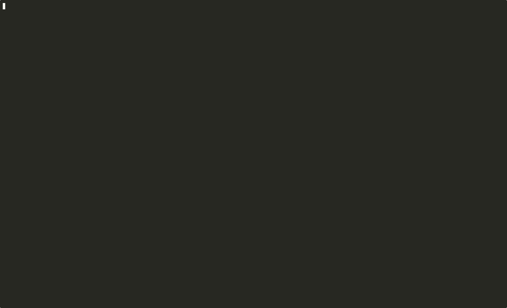

<p align="center">  </p>

# ⚙️ AuraConfig


**Framework modular y minimalista para widgets personalizados en sistemas Linux.**

[🇬🇧 English](README.md)| [🇵🇹 Português](README.pt.md)

AuraConfig es un ecosistema ligero basado en Bash para crear widgets modulares. Diseñado bajo la filosofía Unix, es totalmente compatible con los estándares XDG y se apoya en el motor de traducciones **Lexis** para un soporte multiidioma eficiente y de alto rendimiento.

---

## 📺 Demo



*Ejemplo de `list`, `info`, salida para `waybar` y gestión de errores.*

---

## 🎯 Quick Start

```bash
# Clonar e instalar
git clone https://github.com/edgarmasague/auraconfig.git
cd auraconfig
make install

# Probar
aura helloworld
aura list
aura help
```

## ✨ Características

- 🌍 **i18n con [Lexis](https://github.com/edgarmasague/lexis)** - Integración con el motor de traducciones de alto rendimiento sin dependencias externas.
- 🎨 **Arquitectura de Salida:** Sistema de renderizado agnóstico que soporta actualmente terminal y formatos JSON, diseñado para ser extensible.
- 🔧 **Arquitectura modular** - Añade funcionalidades simplemente soltando scripts en la carpeta de módulos.
- 📦 **Compatible con XDG** - Respeta la jerarquía de directorios de tu sistema (`~/.config`, `~/.local/share`, etc.) para mantener tu HOME limpio.
- ⚡ **Sistema de Acciones** - Soporte nativo para eventos de clic, scroll y comandos de fondo (como controlar `mpv` o servicios).
- 🎯 **Bash Puro** - Sin sobrecarga, ejecución rápida y extremadamente fácil de personalizar.

---

## 📋 Requisitos

* **Bash 4.0+**
* **jq:** Procesador de JSON esencial para la comunicación y configuración de los módulos.
* **GNU Make (Opcional):** Para facilitar la gestión de instalación/desinstalación.
* **Nerd Fonts (Opcional):** Para soporte de iconos extendido en los widgets

| Distribución        | Comando de Instalación        |
| ------------------- | ----------------------------- |
| **openSUSE**        | `sudo zypper install jq make` |
| **Arch Linux**      | `sudo pacman -S jq make`      |
| **Debian / Ubuntu** | `sudo apt install jq make`    |
| **Fedora**          | `sudo dnf install jq make`    |

Si usas `icon_style=nerd-fonts` en `~/.config/auraconfig/.env`, instala solo los símbolos (sin cambiar tu fuente actual) con este comando:

```bash
# 1. Crear directorio local de fuentes (No Root)
mkdir -p ~/.local/share/fonts

# 2. Descargar e instalar solo los símbolos
cd /tmp
curl -OL https://github.com/ryanoasis/nerd-fonts/releases/latest/download/NerdFontsSymbolsOnly.tar.xz
tar -xvf NerdFontsSymbolsOnly.tar.xz -C ~/.local/share/fonts

# 3. Actualizar la caché de fuentes
fc-cache -fv
```

---

## 🚀 Instalación y Gestión (No Root)

AuraConfig se instala íntegramente en el espacio de usuario. **No se requieren privilegios de sudo** para la instalación del framework.

###### Opción A: Usando `make` (Recomendado)

El **Makefile** centraliza la lógica invocando a los scripts de sistema para evitar duplicidad:

```bash
make install      # Instala AuraConfig

make uninstall    # Desinstala AuraConfig
```

### Opción B: Directamente con Bash

Si no tienes `make` o prefieres ejecutar los scripts directamente:

```bash
# Instalar
chmod +x scripts/*.sh
bash scripts/install.sh

# Desinstalar
chmod +x scripts/*.sh
bash scripts/uninstall.sh
```

### Rutas de instalación (XDG compliant)

```
~/.local/bin/aura                 # Ejecutable
~/.local/lib/auraconfig/          # Bibliotecas
~/.local/share/auraconfig/        # Datos (módulos, traducciones)
~/.config/auraconfig/             # Configuración
~/.cache/auraconfig/              # Cache
```

---

## 🖥️ Compatibilidad de Paneles

| Interfaz          | Estado            | Tipo de Salida            |
| ----------------- | ----------------- | ------------------------- |
| **Terminal**      | ✅ Nativo          | Texto plano formateado    |
| **Waybar**        | ✅ Nativo          | JSON estructurado         |
| **Polybar / DWM** | 🛠️ En desarrollo | Texto plano (planificado) |

---

## ⚙️ Configuración

AuraConfig se configura mediante `~/.config/auraconfig/.env`:

```bash
# Idioma (auto|en|es|pt)
lang=auto

# Estilo de iconos (emoji|nerd-fonts|ascii)
icon_style=emoji

# Mostrar iconos en terminal (true|false)
show_icons=true

# Intervalo de actualización (segundos)
update_interval=10
```

---

## 📦 Ejemplo: Módulo Hello World

Un módulo funcional se integra mediante tres componentes básicos:

1. **Metadatos** (`module.json`) - Define nombre, versión y ajustes base

2. **Lógica** (`helloworld.sh`) - Función para procesar datos y funciones de acción

3. **Traducción** (`lang/es.lex`) - Diccionario clave-valor para Lexis

### Uso:

```bash
# Ver el widget en terminal
aura helloworld
```

### Output esperado:

```bash
$ aura helloworld
[✓] 👋 Hello, Mundo!
Este es un módulo de ejemplo simple
```

---

## 📁 Estructura del Proyecto

```
auraconfig/
├── bin/
│   └── auraconfig              # Ejecutable principal
├── lib/                        # Bibliotecas core
│   ├── lexis.sh               # Motor i18n
│   ├── i18n.sh                # Sistema de idiomas
│   ├── env.sh                 # Cargador de configuración
│   ├── log.sh                 # Sistema de logging
│   ├── modules.sh             # Gestor de módulos
│   ├── output.sh              # Renderizado de salida
│   └── help.sh                # Sistema de ayuda
├── share/
│   ├── VERSION
│   ├── lang/                  # Traducciones core
│   │   ├── en.lex, es.lex, pt.lex
│   │   └── help/              # Archivos de ayuda
│   └── modules/               # Módulos incluidos
│       └── helloworld/
│           ├── module.json
│           ├── helloworld.sh
│           └── lang/
│               ├── en.lex
│               ├── es.lex
│               └── pt.lex
├── scripts/                   # Scripts de instalación
│   ├── common.sh              # Funciones compartidas
│   ├── install.sh             # Script de instalación
│   └── uninstall.sh           # Script de desinstalación
├── Makefile
├── .env.example               # Plantilla de configuración
└── README.md
```

---

## 🗺️ Roadmap

- [x] **Core** - Sistema de módulos y motor de renderizado base
- [x] **i18n** - Integración completa con el motor Lexis
- [ ] **Nuevos Outputs** - Soporte nativo para Polybar, DWM, Lemonbar
- [ ] **Librería de Módulos** - Widgets oficiales (CPU, Memoria, Red, Batería)

---

## 🤝 Contribuir

Las contribuciones son bienvenidas. Por favor, abre un issue o pull request.

---

## 📝 Licencia

Licencia MIT. Consulta el archivo [LICENSE](LICENSE) para más detalles.

---

**Hecho con ⚙️ y ❤️ por [Edgar Masague](https://github.com/edgarmasague)**